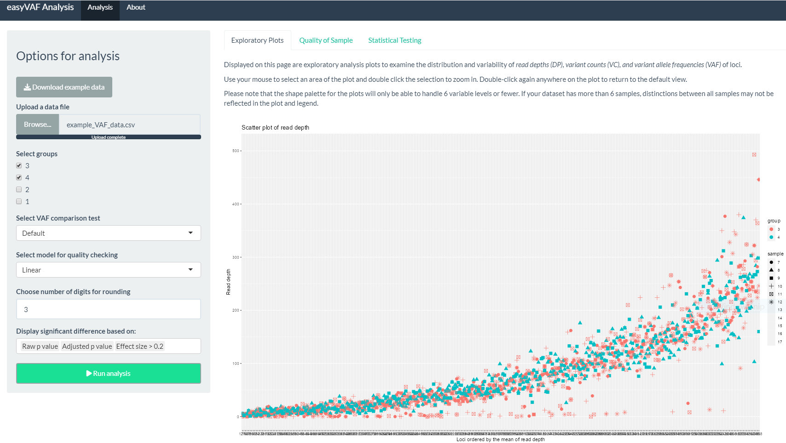

```{r setup, include=FALSE}
# Load data into global environment. 
library(easyVAF)
library(knitr)
```

# Summary

Somatic sequence variants are associated with a cancer diagnosis, prognostic stratification, and treatment response. Variant allele frequency (VAF) is the percentage of sequence reads with a specific DNA variant over the read depth at that locus. Researchers often compare VAFs of targeted loci under different experimental conditions. Because this is a common analysis with burgeoning clinical applications, a set of tools to streamline the process is valuable. The R package "easyVAF" allows for parametric and non-parametric comparison of VAFs among multiple treatment groups. It is accompanied by an interactive R Shiny App for ease of use.

# Statement of need

VAF is useful for assessing the unique and complex set of genomic variations. VAF analyses are widely conducted on sequencing data, particularly in cancer research, to identify and validate DNA variants. Though there is a rich ecosystem of bioinformatic software on various platforms, a library specifically targeted for downstream comparison of VAF has been missing from the R environment.

"easyVAF" is a flexible R package designed to support investigators in analyzing VAF across multiple treatment groups. A user-friendly Shiny app accompanies the package and includes interactive plots, customizable options for analysis, and a downloadable table of loci with comparison results.

When working with the package functions, we recommend the following VAF analysis workflow:

1.  Start with exploratory plots for read depth, variant allele count, and VAF to check the quality of the sample (i.e., unexpected biological variability, batch effect, technical effect).

2.  Conduct a statistical test to assess the variability of overall VAF distribution among the experiment samples (i.e., test if the heterogeneity of experiment samples is significant within each treatment group).

3.  Perform the main comparison of VAFs, which runs as described below:

    a.  For each locus, first conduct the goodness-of-fit test for binomial distribution (overdispersion).

    b.  Select an appropriate method (model-based or non-parametric) according to the results from 3a for the VAF comparison among treatment groups.

The output is a table reporting the raw and adjusted p-values for each locus, as well as the estimated VAFs, the difference in VAFs, and the corresponding $95\%$ confidence intervals (only available for two group comparisons).

# Statistical Method

## Quality of sample

The investigator might be concerned about the biological or experimental variability of the experiment samples before conducting the comparison analysis for the VAFs. The *QCchecking* function runs a likelihood ratio test to assess the variability of overall VAF distribution among samples using a linear mixed model, adjusting for potential non-independence of VAFs within the same chromosome. An alternative test using a linear model without random effects is provided as an alternative option if the dependence of VAFs within the same chromosome is not a concern. If sample heterogeneity is significant, we recommend increasing sample size or incorporating important biological covariates into analysis to increase statistical power and estimation accuracy.

## Main comparison of VAFs among N groups

The main purpose of this software is to compare the VAFs of specific loci among multiple groups, given the variant allele counts and read depths from each sample. Without model assumptions, the data can be presented in two (1 or 0 indicates the presence or absence of a variant allele, respectively) by N (number of groups) contingency tables for each locus. In this software, the *VAFmain* function conducts Fisher's exact test [@fisher1970ra] as default to examine the significance of the difference in VAFs among the N groups. Fisher's exact test is set as the default since it is valid for all sample sizes and provides the exact p-values. The Pearson's Chi-squared test [@pearson1900x], is also provided as an option, which generates comparable results to the exact test for a large sample size (i.e., large number of cell counts in the contingency table). Since Fisher's exact test may be computationally in-feasible for large sample sizes and the accuracy of the Chi-squared approximation increases with larger number of samples, the Chi-squared test maybe considered in this case.

## Beta-binomial model for overdispersion

The main comparison using a contingency table assumes that all samples within one group have the same VAF for a specific locus. In practice, VAF can differ among samples within the same group due to biological variability. To account for this additional variability in VAF among samples, "easyVAF" implements a VAF model using a beta-binomial distribution.

The proposed beta-binomial model is formulated as follows: Let $Y_{ij}$ denote the variant allele count for sample $i$ in group $j$, and $n_{ij}$ denote the read depth for sample $i$ in group $j$, for $i$ in $1,2,$...$,m$; and $j$ in $1,2,$...$,N$. Then

```{=tex}
\begin{equation}\label{eq:Yij}
Y_{ij}|P_{ij} \sim Binomial(n_{ij}, P_{ij})
\end{equation}
```
with probability mass function

```{=tex}
\begin{equation}\label{eq:binompmf}
f(y) = {n_{ij}\choose y}P_{ij}^y(1-P_{ij})^{(n_{ij}-y)}.
\end{equation}
```
And $P_{ij}$ follows a Beta distribution

```{=tex}
\begin{equation}\label{eq:Pij}
P_{ij} \sim Beta(a_{j}, b_{j}),
\end{equation}
```
with probability density function

```{=tex}
\begin{equation}\label{eq:betapdf}
g(p) = \frac{p^{a_j-1}(1-p)^{b_j-1}}{B(a_j, b_j)},
\end{equation}
```
in which $B(a_j, b_j)$ denotes the beta function.

The probability mass function of the marginal beta-binomial distribution for $Y_{ij}$ is then

```{=tex}
\begin{equation}\label{eq:betabinpmf}
h(y) = {n_{ij}\choose y}\frac{B(y+a_j, n_{ij}-y+b_j)}{B(a_j, b_j)}.
\end{equation}
```
Let $\theta_j$ denote the mean VAF and $\phi_j$ denote the dispersion parameter for group $j$, then with reparameterization

```{=tex}
\begin{equation}\label{eq:theta}
\theta_j = \frac{a_j}{a_j+b_j};
\end{equation}
```
```{=tex}
\begin{equation}\label{eq:phi}
\phi_j = \frac{1}{a_j+b_j+1}.
\end{equation}
```
The likelihood ratio test is conducted to test the hypothesis

$H_0$: $\theta_j=\theta$ for all $j$,

$H_1$: $\theta_j$s are not all equal.

using the marginal beta-binomial likelihood.

## Test for Binomial overdispersion

The package includes a *Tarone.test* function [@tarone1979testing] to assist with the choice of test for the main comparison. For each group, the Tarone test evaluates the goodness of fit of the binomial distribution, which is the optimal test against the beta-binomial alternative [@tarone1979testing]. For group $j$, the test statistic $Z_j$ is defined by the equation

```{=tex}
\begin{equation}\label{eq:Zj}
Z_j = \frac{S-\sum_i n_{ij}}{\sqrt{(2\sum_i n_{ij} (n_{ij}-1))}},
\end{equation}
```
in which,

```{=tex}
\begin{equation}\label{eq:S}
S = \sum_i \frac{(y_{ij}-n_{ij}\hat{p}_j)^2}{\hat{p}_j(1-\hat{p}_j)},
\end{equation}
```
```{=tex}
\begin{equation}\label{eq:phat}
\hat{p}_j = \frac{\sum_i y_{ij}}{\sum_i n_{ij}}.
\end{equation}
```
And $Z_j$ follows an asymptotic standard normal distribution under the null hypothesis with zero dispersion.

## Multiple comparison

VAF analysis is typically performed for multiple loci. Multiple comparison adjustment is implemented to control the false discover rate using Benjamini & Hochberg's method [@benjamini1995controlling].

## The R package

The R package was built under R version 4.1.0 (2021-05-18) [@R]. The package has the following dependencies: lme4 [@lme4], aod [@aod], dplyr [@dplyr], tibble [@tibble], and ggplot2 [@ggplot2].

## The Shiny app

The accompanying Shiny app can be found at <https://vapps-uccc-bs.shinyapps.io/easyVAFanalysis/>.

In addition to the "easyVAF" package dependencies, the app was built with: shiny [@chang2017shiny], shinythemes [@chang2018shinythemes], DT [@DT], ggiraph [@gohel2016ggiraph], and cowplot [@cowplot].

### Exploratory plots

In addition to deploying the functions from the package, the app includes exploratory plots that allow the user to quickly view the distribution of their data. These are scatter plots of the loci, ordered on the x-axis by the mean of read depth, for read depth, variant count, and VAF (computed from the previous two values). Sections of the plots can be enlarged by drawing a box on a target area and double-clicking the selection.



# Example

## Data requirement

For illustrative purposes, an example data set, which is derived by resampling (with replacement) from a real DNA sequencing application with pseudo locus ID and chrome ID, is included in the package. The *VAFmain* function requires a data frame input with the columns named exactly as below,

```{r data, results="asis", warning = FALSE, message=FALSE}
data(VAF)
names(VAF)

print(kable(head(VAF), row.names=F,
            caption="VAF data example"))

```

where Locus contains the locus ID, vc contains variant count, dp contains read depth, chrom contains the chrom ID, sample contains the sample ID, and group contains group ID.

## Quality test results

In the "Quality of Sample" tab, view the distribution of VAF by group and the likelihood ratio test results. The R code and results using the package directly are shown below.

```{r QC, results="asis", warning = FALSE, message=FALSE}

rslt <- QCchecking(data=VAF, method="lm")
print(kable(rslt))

rslt <- QCchecking(data=VAF, method="lmer")
print(kable(rslt))

```

## Analysis results

For analyses on exactly two groups, the app displays a three-panel graph of the loci comparing different selection methods in the "Statistical testing" tab. The user can zoom in and out, hover over the points in the graph to see the locus ID, click on individual points or use the lasso tool to select points, and see selected loci in the corresponding results table. For three or more groups, only the loci table is available. The R code and results using the package directly are shown below.

```{r main, results="asis", warning = FALSE, message=FALSE}

data(VAF)

#4 groups
groups <- unique(VAF$group)[c(1:4)]
rslt <- VAFmain(data=VAF, groups=groups)
rslt$P.value <- as.numeric(rslt$P.value)
toploci <- head(rslt[order(as.numeric(rslt$P.value)), 
                     c("ID",
                       "P.value",          
                       "Overdispersion",   
                       "p.adjust",       
                       "sig.diff.fdr")], n=10)

print(kable(toploci, row.names=F,
            caption="Top 10 significantly different loci, 
                     multiple group comparison",
            digits=3))
            
#2 groups
groups <- unique(VAF$group)[c(1:2)]
rslt <- VAFmain(data=VAF, groups=groups)
rslt$P.value <- as.numeric(rslt$P.value)
toploci <- head(rslt[order(as.numeric(rslt$P.value)), 
                     c("ID", 
                       "Effect.size", 
                       "95% CI", 
                       "p.adjust",       
                       "sig.diff.fdr", 
                       "Change.direction")], n=10)

print(kable(toploci, row.names=F,
            caption="Top 10 significantly different loci, two groups",
            digits=3))
            
dat1 <- rslt[,c("Read.Depth.3", 
                "VAF.3", 
                "Read.Depth.4", 
                "VAF.4", 
                "sig.diff")]
dat1$method <- "p.value raw"
names(dat1)[5] <- "Change"
dat2 <- rslt[,c("Read.Depth.3", 
                "VAF.3", 
                "Read.Depth.4", 
                "VAF.4", 
                "sig.diff.fdr")]
dat2$method <- "p.value FDR"
names(dat2)[5] <- "Change"
dat3 <- rslt[,c("Read.Depth.3", 
                "VAF.3", 
                "Read.Depth.4", 
                "VAF.4", 
                "sig.change.20")]
names(dat3)[5] <- "Change"
dat3$method <- "Change > 0.2"

pdat <- rbind(dat1,dat2,dat3)


pdat$Total.Depth <- (as.numeric(pdat$Read.Depth.3)+
                     as.numeric(pdat$Read.Depth.4))/
                     max(as.numeric(pdat$Read.Depth.3)+
                     as.numeric(pdat$Read.Depth.4))*5
p <- ggplot(pdat, 
            aes(x = as.numeric(VAF.3), 
                y = as.numeric(VAF.4), 
                color=Change))+
  geom_point(alpha = 0.5, size = pdat$Total.Depth)+
  scale_size_area()+
  xlab(paste("VAF", groups[1]))+
  ylab(paste("VAF", groups[2]))+ 
  facet_grid(cols = vars(method))+
  ggtitle("Three selection methods", 
          subtitle = "Total read depth is represented by dot size")

print(p)

```

# Citations
